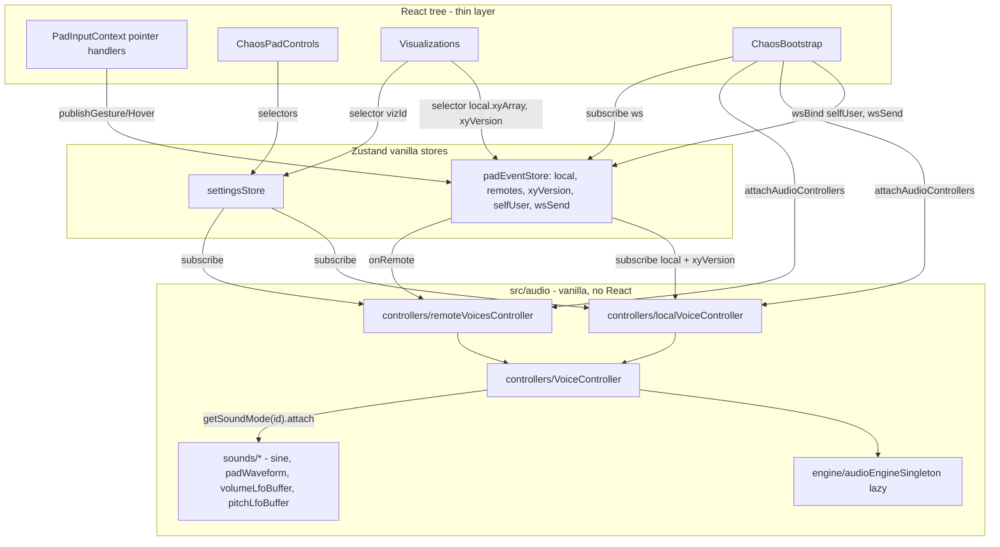

# Chaos Pad — architecture

A **Next.js** (App Router) web app: a full-screen pad for touch/mouse-driven sound, pointer sync over **WebSocket**, visualization modes, and a debug spectrogram tapped from the **shared** audio output.

## Stack

- **Next.js**, **React**, **TypeScript**, **Tailwind CSS**
- **Zustand** — global stores for settings and pad state
- **Web Audio API** — `AudioEngine` / `Voice`, one **`masterAnalyser`** on the summed output
- **ws** — separate WebSocket relay process

## Principle

Synthesis and pad state live **outside the React render loop**: in Zustand stores and singleton controllers. Components only handle DOM events and UI — no `useEffect` chains, `useRef` for voices, or memo tricks.



## Component tree (page)

[`src/app/page.tsx`](src/app/page.tsx):

1. **`WebSocketProvider`** — connection, `userId`, color, `send`, `subscribe`. No business logic, only the channel.
2. **`ChaosPad`** — renders [`ChaosBootstrap`](src/components/ChaosPad/ChaosBootstrap.tsx), [`Pad`](src/components/ChaosPad/Pad/Pad.tsx), and [`ChaosPadControls`](src/components/ChaosPad/ChaosPadControls.tsx).

## Data layers

`src/state/` — UI stores (`padEventStore`, `settingsStore`) and the `usePadEvents` hook for visualizations. `src/audio/` — all synthesis: `engine/` (AudioEngine, Voice, singleton, helpers), `sounds/` (sound kinds via the `SoundMode` interface), `controllers/` (bridge from stores to engine via `VoiceController`), `padWaveform.ts` (bin buffer).

### State stores ([`src/state/`](src/state/))

#### [`settingsStore`](src/state/settingsStore.ts)

Holds `vizId`, `spectralDebugOpen`, `release`, `reverbLevel`, `volume`, `quantize`, `soundModeId`, and setters. Use **narrow selectors**: `useSettingsStore(s => s.volume)`.

#### [`padEventStore`](src/state/padEventStore.ts)

| Field | Purpose |
|----------|----------|
| `selfUser` | `{ userId, color }` for the local client (filled in `ChaosBootstrap` via `wsBind`). |
| `wsSend` | Injected WS sender for outgoing messages. |
| `local` | Last local gesture snapshot (`UserPadState`), including its own `xyArray` (256 bins). On `wsBind`, a shell is created with `updatedAt: 0` and an empty `xyArray` — hover writes into that buffer until a gesture starts. |
| `remotes` | Map of latest snapshots per `userId`; each has its own `xyArray`. |
| `xyVersion` | Global counter incremented on any bin change (hover / gesture / remote). Visualizations and controllers use it as a “bins changed” signal. |

Actions: `wsBind`, `publishGesture`, `publishHover`, `applyRemoteEvent`. Side-channel `onRemote(cb)` — low-level subscription to remote messages (used by `remoteVoicesController` to react to **every** WS message, no diff).

#### [`audioEngineSingleton`](src/audio/engine/audioEngineSingleton.ts)

Lazy `AudioEngine` init via `getOrCreateEngine()`. Created on first gesture to respect autoplay policy. `subscribeEngine(cb)` for UI that must react when the engine appears or disappears (e.g. [`SpectralDebugPanel`](src/components/ChaosPad/spectralDebug/SpectralDebugPanel.tsx)).

### Audio engine ([`src/audio/engine/`](src/audio/engine/))

- **`AudioEngine`** ([`AudioEngine.ts`](src/audio/engine/AudioEngine.ts)): master chain `convolver` → `convolverGain` → `masterGain` → `tremoloGain` → **`masterAnalyser`** → `destination`. Reverb impulse — [`createImpulseResponse`](src/audio/engine/helpers/createImpulseResponse.ts); context with `latencyHint: 'playback'`. `createVoice(position, quantize)` is the voice factory.
- **`Voice`** ([`Voice.ts`](src/audio/engine/Voice.ts)): `OscillatorNode` → per-voice gain → `masterGain` and `convolver`. Knows position (`updatePosition` / `refreshPosition`), quantize, `pitchLfoMul`. **Does not know sound kinds**: exposes `setOscillatorType('sine')` / `setOscillatorWave(PeriodicWave)` / `setPitchLfoMul(m)`.

### Sound modes ([`src/audio/sounds/`](src/audio/sounds/))

Each sound kind is a self-contained module implementing `SoundMode` ([`types.ts`](src/audio/sounds/types.ts)):

```typescript
type SoundMode = {
  id: SoundModeId
  label: string
  attach(ctx: { engine, voice, getXyArray }): SoundAttachment
}

type SoundAttachment = {
  onXyUpdate?: () => void   // called when bins change
  dispose: () => void
}
```

Registry — [`registry.ts`](src/audio/sounds/registry.ts): `SOUND_MODES` array + `getSoundMode(id)`. Adding a new sound = add `sounds/<id>/<id>Mode.ts` + register in the array and `SoundModeId`.

Current implementations:

- [`sine/sineMode.ts`](src/audio/sounds/sine/sineMode.ts) — `voice.setOscillatorType('sine')`.
- [`padWaveform/padWaveformMode.ts`](src/audio/sounds/padWaveform/padWaveformMode.ts) — `voice.setOscillatorWave(binsToPeriodicWave(...))`. `onXyUpdate` recomputes the wave with **internal 110ms throttle** via [`shared/throttle.ts`](src/audio/sounds/shared/throttle.ts). On `dispose`, restores `'sine'`.
- [`volumeLfoBuffer/volumeLfoBufferMode.ts`](src/audio/sounds/volumeLfoBuffer/volumeLfoBufferMode.ts) — rAF loop from [`shared/bufferLfoLoop.ts`](src/audio/sounds/shared/bufferLfoLoop.ts) writes sample into `engine.tremoloGain.gain.value`.
- [`pitchLfoBuffer/pitchLfoBufferMode.ts`](src/audio/sounds/pitchLfoBuffer/pitchLfoBufferMode.ts) — same rAF loop, sample → `voice.setPitchLfoMul(...)`.

`shared/bins.ts` — `EMPTY_EPS`, `maxBin`, `sampleBinsAtPhase` for all bin consumers.

### Controllers (vanilla, no React) ([`src/audio/controllers/`](src/audio/controllers/))

#### [`VoiceController`](src/audio/controllers/VoiceController.ts)

Wraps one `Voice` + active `SoundAttachment`. API:

- `setMode(id)` — `dispose` old attachment → `attach` new one.
- `setPosition(nx, ny)`, `setQuantize(q)`, `notifyXyUpdate()`, `stop(release)`.

Local/remote controllers work **only** through `VoiceController` — no `switch` on `soundModeId`.

#### [`localVoiceController`](src/audio/controllers/localVoiceController.ts)

Subscribes to `padEventStore.local`, `padEventStore.xyVersion`, and `settingsStore`:

- `local.type === 'start'` → `getOrCreateEngine()`, resume, `new VoiceController(...)` with current `soundModeId`.
- `local.type === 'move'` → `requestAnimationFrame` throttle, `vc.setPosition(...)`.
- `local.type === 'stop'` → `vc.stop(release)`.
- `xyVersion` changes → `vc.notifyXyUpdate()` (throttle/reaction lives inside the active mode).
- Changes to `volume` / `reverbLevel` → `engine.set*`; `quantize` → `vc.setQuantize`; `soundModeId` → `vc.setMode`.

#### [`remoteVoicesController`](src/audio/controllers/remoteVoicesController.ts)

Subscribes to `padEventStore.onRemote` and `settingsStore`. Holds `Map<userId, VoiceController>`. On `start`, creates VC with `getXyArray = () => padEventStore.getState().remotes[userId]?.xyArray`; on `move` — `vc.setPosition` + `vc.notifyXyUpdate()`; on `stop` — `vc.stop()` + `delete`. On settings change, forwards `setQuantize` / `setMode` to all active VCs.

#### [`attachAudioControllers`](src/audio/controllers/index.ts)

Single public bootstrap entry: mounts both controllers and returns `detach`.

### Bootstrap ([`ChaosBootstrap.tsx`](src/components/ChaosPad/ChaosBootstrap.tsx))

The only React node that wires WS to state. In `useEffect`:

- `padEventStore.wsBind({ selfUser, wsSend })`,
- `attachAudioControllers()`,
- `subscribe(msg => padEventStore.applyRemoteEvent(msg))`.

Cleanup: detach controllers and `closeEngine()`.

### Public audio module API ([`src/audio/index.ts`](src/audio/index.ts))

From outside `src/audio/` only: `attachAudioControllers`, `soundModes`, `defaultSoundModeId`, `SoundModeId`, `getEngine`, `subscribeEngine`. `AudioEngine`, `Voice`, `VoiceController`, and `SoundMode` objects themselves are internal.

### Pad waveform buffer ([`src/audio/padWaveform.ts`](src/audio/padWaveform.ts))

`PAD_WAVEFORM_BINS = 256`. `applySample` / `applySegment` mutate `Float32Array` bins in place; `padEventStore` uses them in `publishGesture` / `publishHover` / `applyRemoteEvent` on the corresponding `xyArray`.

## Pad UI

- [`Pad`](src/components/ChaosPad/Pad/Pad.tsx) → [`PadSurfaceProvider`](src/components/ChaosPad/Pad/PadSurfaceContext.tsx) (size) → [`PadInputProvider`](src/components/ChaosPad/Pad/PadInputContext.tsx) (pointer handlers call `padEventStore.publishGesture` / `publishHover`).
- [`PadLayer`](src/components/ChaosPad/Pad/PadLayer.tsx) renders the active viz ([`ActiveViz`](src/components/ChaosPad/Pad/ActiveViz.tsx)) + [`WaveformBufferViz`](src/components/ChaosPad/Pad/visualizations/WaveformBufferViz.tsx) on top + transparent capture div.

## Visualizations ([`src/components/ChaosPad/Pad/visualizations/`](src/components/ChaosPad/Pad/visualizations/))

- **Glow** / **Squares** — particles via [`useParticles`](src/components/ChaosPad/Pad/visualizations/useParticles.ts), subscription via [`usePadEvents`](src/state/hooks/usePadEvents.ts) (local tick throttle).
- **WebGL** — pixel shader reads position from `padEventStore.local` / `remotes`.
- **WaveformBufferViz** — line + fill from `padEventStore(s => s.local?.xyArray)`, redraw on `s.xyVersion`.

## Flow: gesture → sound and buffer

1. Pointer event → `PadInputContext` → `padEventStore.publishGesture` / `publishHover` → updates `local`, mutates `local.xyArray`, increments `xyVersion`, sends over WS via `wsSend`.
2. `padEventStore.subscribe(local)` → `localVoiceController` creates/updates voice via `VoiceController`; rAF throttle for `move`.
3. `padEventStore.subscribe(xyVersion)` → `vc.notifyXyUpdate()` → active `SoundAttachment.onXyUpdate?.()` (e.g. `padWaveformMode` recomputes `PeriodicWave` with internal throttle).
4. WS receive → `ChaosBootstrap` → `padEventStore.applyRemoteEvent` → updates `remotes[uid]` and its `xyArray`, increments `xyVersion`, emits `onRemote`.
5. `padEventStore.onRemote` → `remoteVoicesController` creates/updates remote `VoiceController`.
6. `settingsStore` changes (volume/reverb/quantize/soundMode) → controllers react via `subscribe` with diff, no React re-render.

## Selector discipline

In components, **always** use narrow selectors: `useStore(s => s.field)` (or `useShallow` for objects). That is where Zustand pays off — otherwise you get provider-wide rerenders.

## WebSocket server

[`src/ws-server.mjs`](src/ws-server.mjs) — broadcasts incoming messages to all other clients. Default port **3003**. Client URL — [`getPublicWebSocketUrl`](src/config.ts) from `NEXT_PUBLIC_WS_URL`. `npm run dev:ws` runs Next and WS in parallel ([`package.json`](package.json)).

## Directory layout (abbreviated)

```
src/
  app/
  audio/                       # non-React audio layer
    index.ts                   # public API: attachAudioControllers, soundModes, getEngine
    engine/                    # AudioEngine, Voice, audioEngineSingleton, helpers
      helpers/                 # binsToPeriodicWave, createImpulseResponse, quantizeFreq,
                               # updateSoundFromPosition, getSoundParams
    sounds/                    # sound kinds (strategy pattern)
      types.ts                 # SoundMode, SoundContext, SoundAttachment, SoundModeId
      registry.ts              # SOUND_MODES + getSoundMode(id)
      sine/                    # sineMode
      padWaveform/             # padWaveformMode (internal throttle)
      volumeLfoBuffer/         # volumeLfoBufferMode
      pitchLfoBuffer/          # pitchLfoBufferMode
      shared/                  # bins, bufferLfoLoop, throttle
    controllers/               # local + remote + shared VoiceController
    padWaveform.ts             # bin buffer (applySample, applySegment)
  components/
    WsContext/                 # thin ws channel (no business logic)
    ChaosPad/
      ChaosPad.tsx
      ChaosBootstrap.tsx       # WS bridge + attachAudioControllers
      ChaosPadControls.tsx
      padEvents.types.ts       # UserPadState (with xyArray), VisEvent, RemotePadEvent
      Pad/                     # PadSurface, PadInput, PadLayer, ActiveViz, visualizations/
      spectralDebug/           # spectrogram from masterAnalyser
      helpers/
  state/
    padEventStore.ts           # local + remotes + xyVersion + onRemote
    settingsStore.ts
    hooks/usePadEvents.ts
  config.ts
  type.ts
  ws-server.mjs
```
