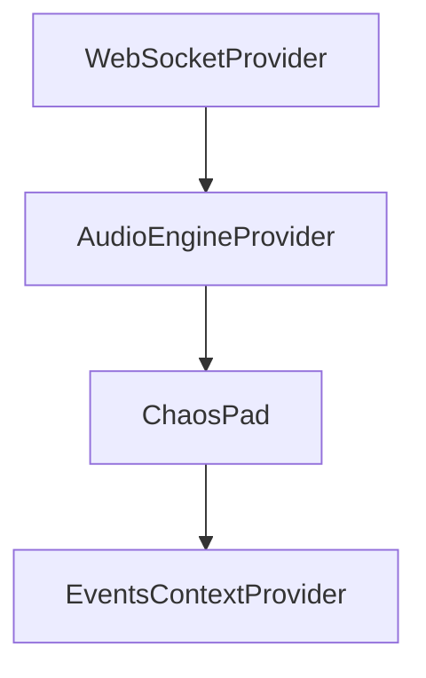

# Chaos Pad — архитектура

Веб-приложение на **Next.js** (App Router): полноэкранная площадка для управления звуком по касанию/мыши, синхронизация указателей по **WebSocket**, режимы визуализации и отладочная спектрограмма с **общего** аудиовыхода.

## Стек

- **Next.js**, **React**, **TypeScript**, **Tailwind CSS**
- **Web Audio API** — `AudioEngine` / `Voice`, один **`masterAnalyser`** на суммарный выход
- **ws** — отдельный процесс ретранслятора WebSocket

## Дерево провайдеров (страница)

Порядок снаружи внутрь ([`src/app/page.tsx`](src/app/page.tsx)):

1. **`WebSocketProvider`** — соединение с WS, локальное состояние указателя (`pos`, `type`), рассылка и приём JSON с нормализованными координатами `nx`/`ny`.
2. **`AudioEngineProvider`** — один `AudioContext`, общий мастер-гейн, реверб и **`masterAnalyser`** перед `destination` (сумма всех голосов + сухой/мокрый сигнал).
3. **`ChaosPad`** оборачивает контент в **`EventsContextProvider`** — снимки событий пада, буфер waveform и API для их обновления.



## Слои данных

### WebSocket ([`src/components/WsContext/`](src/components/WsContext/))

- `userId`, цвет пользователя, `pos: { nx, ny }`, `type` жеста (`start` / `move` / `stop`), последнее входящее сообщение от других клиентов (`message`).
- Координаты **нормализованы к вьюпорту** (0…1).
- Типы: [`src/type.ts`](src/type.ts).

### Audio ([`src/components/AudioEngineContext/`](src/components/AudioEngineContext/))

- **`AudioEngine`**: `convolver` → `convolverGain` → `masterGain` → **`masterAnalyser`** → `destination`. Импульс ревёрба задаётся в [`createImpulseResponse`](src/components/AudioEngineContext/helpers/createImpulseResponse.ts); контекст с `latencyHint: 'playback'`.
- **`Voice`**: `OscillatorNode` → гейн → **напрямую** в `masterGain` и в `convolver` (без анализатора на голос). Частота и гейн из `(nx, ny)` через [`getSoundParams`](src/components/AudioEngineContext/helpers/getSoundParams.ts) и квантайз. Режимы: **`setSoundMode('sine')`** или **`setSoundMode('padWaveform', bins)`** ([`binsToPeriodicWave`](src/components/AudioEngineContext/helpers/binsToPeriodicWave.ts)); для custom-волны гейн слегка компенсируется относительно синуса.
- Локальный голос — [`useChaosAudio`](src/components/ChaosPad/hooks/useChaosAudio.ts), режим звука — [`sounds/index.ts`](src/components/ChaosPad/sounds/index.ts). Удалённые голоса — [`useChaosWebSocket`](src/components/ChaosPad/hooks/useChaosWs.ts) + [`handleRemoteAudio`](src/components/ChaosPad/helpers/handleRemoteAudio.ts): тот же **`soundModeId`**, что у слушателя; для **Buffer** на каждого `userId` свой `Float32Array` и сегментная интерполяция по `nx`/`ny`, плюс троттлинг `setSoundMode`.

### Events ([`src/components/ChaosPad/EventsContext/`](src/components/ChaosPad/EventsContext/))

Публичный контракт описан в **`PadEventsApi`** ([`padEvents.types.ts`](src/components/ChaosPad/EventsContext/padEvents.types.ts)) и реэкспортируется из [`index.ts`](src/components/ChaosPad/EventsContext/index.ts).

| Часть API | Назначение |
|-----------|------------|
| **`local`** | Снимок последнего **локального** события из WebSocket: `VisEvent` (`nx`, `ny`, `color`, `type`) — жест **с нажатием** (`start` / `move` / `stop`). |
| **`remote`** | Последнее **удалённое** событие: `RemotePadEvent` + `userId`. |
| **`padWaveform`** | Стор буфера формы волны: `PAD_WAVEFORM_BINS` (256), [`applySegment`](src/components/ChaosPad/EventsContext/padWaveform.ts) по сегментам между точками, подписка на версию через **`usePadWaveform`**. |
| **`emitPadHover`** | Вызывается из UI при движении по паду **без зажатой ЛКМ** (или touch): обновляет буфер waveform. При **зажатой** кнопке мыши буфер не пишется из этой точки. |

Хуки:

- **`useEvents()`** — полный **`PadEventsApi`**.
- **`usePadLocal()`** / **`usePadRemote()`** — только снимки `local` / `remote`.
- **`usePadWaveform()`** — `bins` + `version` для отрисовки и аудио.
- **`usePadEventHandlers({ onLocal, onRemote, ... })`** — подписка на локальные/удалённые события для визуализаций (троттлинг локального тика).

### ChaosPad UI ([`src/components/ChaosPad/ChaosPad.tsx`](src/components/ChaosPad/ChaosPad.tsx))

- Область захвата указателя; переключатели визуализации ([`visualizations/index.ts`](src/components/ChaosPad/visualizations/index.ts)) и звука ([`sounds/index.ts`](src/components/ChaosPad/sounds/index.ts)).
- Поверх выбранного эффекта — **`WaveformBufferViz`** (WebGL: заливка + линия по буферу).
- Опционально **Spectrum debug** — [`SpectralDebugPanel`](src/components/ChaosPad/spectralDebug/SpectralDebugPanel.tsx): одна спектрограмма с **`engine.masterAnalyser`** (общий выход).

## Визуализации ([`src/components/ChaosPad/visualizations/`](src/components/ChaosPad/visualizations/))

Реестр: Glow, Squares, WebGL — подписка через **`usePadEventHandlers`** и/или **`usePadWaveform`** / **`useViewportSize`**, частицы — локальное состояние (`useParticles`).

## Сервер WebSocket

[`src/ws-server.mjs`](src/ws-server.mjs) — broadcast входящих сообщений всем остальным клиентам. Порт по умолчанию **3003**.

Клиентский URL: [`getPublicWebSocketUrl`](src/config.ts) из `NEXT_PUBLIC_WS_URL` (по умолчанию `ws://localhost:3003`).

Скрипт **`npm run dev:ws`** поднимает Next и WS-процесс параллельно ([`package.json`](package.json)).

## Поток: жест → звук и буфер

1. **Указатель с нажатием** обновляет `WsContext` (`setPos` / `setType`) → в **`EventsContext`** попадает **`local`** → звук через **`useChaosAudio`**, визуализации через **`usePadEventHandlers`**.
2. **Движение без зажатой ЛКМ** (или touch) по паду вызывает **`emitPadHover`** → **`padWaveform.apply`** (сегменты) — **только** так формируется буфер waveform для режима Buffer и визуализации волны; **не** из `local` move.
3. **`useChaosAudio`** в режиме Buffer подписан на **`padWaveform`** и с троттлингом обновляет `setPeriodicWave`.
4. Удалённые жесты обновляют удалённые голоса и **`remote`**; их буферы waveform на клиенте — в **`useChaosWs`** (те же бины и интерполяция).

## Структура каталогов (сокращённо)

```
src/
  app/
  components/
    AudioEngineContext/
    WsContext/
    ChaosPad/
      ChaosPad.tsx
      sounds/
      EventsContext/       # padEvents.types, padWaveform, провайдер, хуки
      spectralDebug/       # спектрограмма с masterAnalyser
      hooks/                 # useChaosAudio, useChaosWs
      helpers/
      visualizations/
  config.ts
  type.ts
  ws-server.mjs
```
